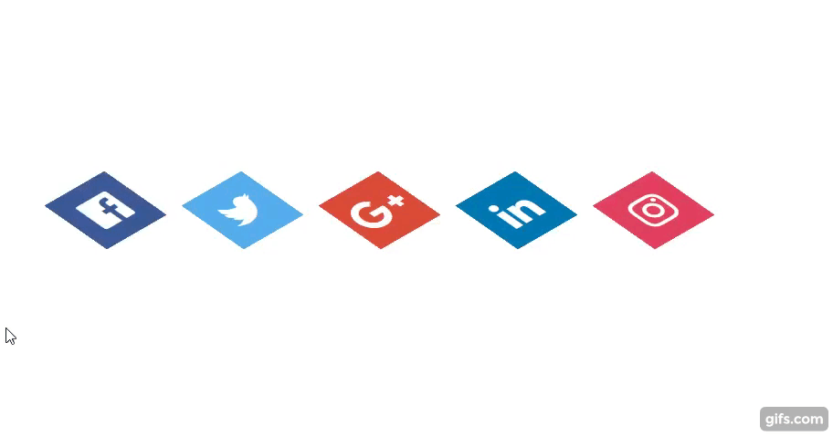

# :turtle: 30diasDeCSS :turtle: 
----------------------------
Challenge of making 30 mini-projects using HTML and CSS during 30 days!
Idealized by  https://github.com/MilenaCarecho/30diasDeCSS.

## What I want to accomplish with this:
:cherry_blossom: Try new things everyday;

:cherry_blossom: Learn more about CSS;

:cherry_blossom: Create new skills;

## Rules
:cherry_blossom: One project everyday;

:cherry_blossom: Otherwise, 3 projects in the next day;

:cherry_blossom: Time limit: 23:59pm;

:cherry_blossom: Post the result in LinkedIn and/or other social media;

## Days
**Day 1 - Social media icon in layers**


Because of this project:

:cherry_blossom: Used ```transform:translate();``` for the first time!

:cherry_blossom: Used ```transform: rotate() skew();``` for the first time!

:cherry_blossom: Used ```box-shadow:``` for the first time!

:cherry_blossom: Used ```transition:``` for the first time!

:cherry_blossom: Discovered what ```height:100mv;``` means!

Extra challenge:
Change the color text for black when hover + altered transition time.


